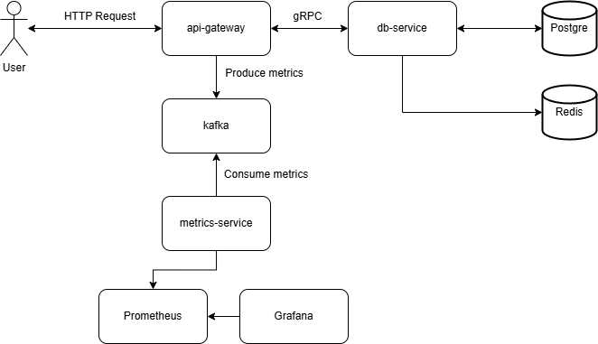

# 📋 Todo App

**Todo App** — это pet-проект с микросервисной архитектурой, созданный главным образом для освоения новых технологий. Разбиение на отдельные сервисы сделано с целью использования различных технологий.

## 🛠 Используемые технологии

- **Go**
- **gRPC**
- **Kafka**
- **PostgreSQL**
- **Redis**
- **Docker-compose**
- **Prometheus**
- **Grafana**
- **Swagger**

## 📂 Архитектура проекта

- **api-gateway**: gRPC-Gateway для маршрутизации REST-запросов к gRPC-сервису `db-service`. Посылает метрики запросов через Kafka в `metrics-service`.
- **db-service**: микросервис для взаимодействия с базой данных PostgreSQL, использует кэширование в Redis.
- **metrics-service**: микросервис для сбора метрик с `api-gateway` и экспорта метрик в Prometheus.
- **protos**: директория с proto-контрактами.
- **migrations**: файлы миграций для настройки схемы базы данных.
- **grafana**: настройки и дашборды для Grafana.
- **prometheus**: конфигурационные файлы для Prometheus.
- **scripts**: скрипты для инициализации и настройки окружения.



## 🚀 Запуск проекта

1. **Клонирование репозитория:**

   ```bash
   git clone https://github.com/Promakash/todo_app.git
   cd todo_app
   ```

2. **Запуск**

   Все команды для запуска есть в `Makefile`.

   ```bash
   # Выполняет чистовой билд с генерацией proto, swagger-документации и линтером
   make build
   ```

   ```bash
   # Выполняет запуск всех сервисов
   make run
   ```

## 📊 Мониторинг

### 📡 Метрики

Проект собирает следующие метрики, которые доступны через Prometheus:

- **http_requests_total**: общее количество реквестов к сервису
- **method**: метод запроса
- **path**: путь запроса
- **http_request_duration**: время выполнения запроса 
- **http_response_size_bytes**: размер ответа в байтах

### 🔗 Доступ к мониторингу

- **Prometheus**: `http://localhost:9090`
- **Grafana**: `http://localhost:3000` (по умолчанию логин и пароль: `admin` / `admin`)

## 🗎 Документация

- Доступна по адресу: `http://localhost:8080/api/v1/docs/`
